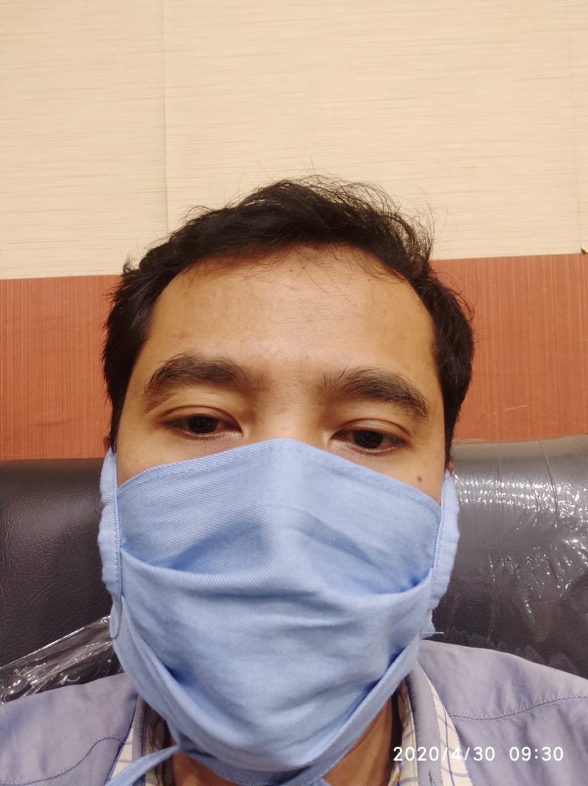

```{r setup, include=FALSE}
library(flexdashboard)
```

Home
===

Row
-----------------------------------------------------------------------

### mhs_aktif {.value-box}

```{r}

valueBox(
  value = paste(format(16250, big.mark = " "), "", sep = " "),
  caption = "Mahasiswa Aktif",
  icon = "fas fa-clipboard-check",
  color = "black"
)
```

### mhs_laki {.value-box}

```{r}

valueBox(
  value = paste(format(7000, big.mark = " "), "", sep = " "),
  caption = "Mahasiswa Laki-Laki",
  icon = "fas fa-male",
  color = "blue"
)
```

### mhs_perempuan {.value-box}

```{r}
valueBox(
  value = paste(format(5000, big.mark = " "), "", sep = " "),
  caption = "Mahasiswa Perempuan",
  icon = "fas fa-female",
  color = "pink"
)
```

### dosen {.value-box}

```{r}
#sudah <- nrow(filter(db, registrasi == "registrasi"))
valueBox(
  value = paste(format(1000, big.mark = " "), "", sep = " "),
  caption = "Dosen Aktif",
  icon = "fas fa-thumbs-up",
  color = "green"
)
```

### tendik {.value-box}

```{r}
#sudah <- nrow(filter(db, registrasi == "registrasi"))
valueBox(
  value = paste(format(1000, big.mark = " "), "", sep = " "),
  caption = "Tenaga Kependidikan",
  icon = "fas fa-thumbs-up",
  color = "green"
)
```


Row
---

### **Laporan Semester**

Berikut adalah laporan semester Subbagian Registrasi dan Statisik.

- 2020-2021 [Ganjil](https://202101.netlify.app){target="_blank"} - Genap
- 2019-2020 Ganjil - [Genap](https://192002.netlify.app){target="_blank"}

### **Penerimaan Mahasiswa Baru**

Berikut adalah laporan penerimaan mahasiswa baru.

- 2020 [SNMPTN](https://pmb20.netlify.app){target="_blank"} - [SBMPTN](https://sbm20.netlify.app){target="_blank"} - SMMPTN - UMM D3
- 2019 SNMPTN - SBMPTN - SMMPTN - UMM D3

Tentang Kami
===

Registrasi dan Statistik adalah salah satu subbagian di bawah Bagian Akademik dan Kemahasiswaan di Biro Akademik, Kemahasiswaan, dan Perencanaan (BAKP) Universitas Sultan Ageng Tirtayasa. Berikut adalah rincian tugas Subbagian Registrasi dan Statistik:

a. melakukan penyusunan program kerja Subbagian;
b. melakukan penyusunan pedoman pelaksanaan penerimaan dan registrasi mahasiswa;
c. melakukan penerimaan mahasiswa baru;
d. melakukan urusan registrasi mahasiswa;
e. melakukan penyiapan kartu mahasiswa, kartu rencana studi, kartu hasil studi dan pemberian nomor induk mahasiswa;
f. melakukan urusan alih program studi;
g. melakukan urusan cuti akademik mahasiswa;
h. melakukan pemrosesan pindah mahasiswa dan/atau pengunduran diri mahasiswa;
i. melakukan penyusunan statistik mahasiswa;
j. melakukan penyimpanan dan pemeliharaan dokumen Subbagian; dan
k. melakukan penyusunan laporan Subbagian.

Subbagian Registrasi dan Statistik dikoordinasi oleh seorang Kepala Subbagian dan dibantu oleh 3 orang staf. Berikut adalah sumber daya manusia di Subbagian Registrasi dan Statistik.

Row
---

### Munawar Holil, S.E. (Kepala Subbagian)

```{r  out.width = "50%", out.height = "50%"}
knitr::include_graphics("image/Al Pacino.jpg") 
```
 
### Sriyanto (Staf)

```{r  out.width = "50%", out.height = "50%"}
knitr::include_graphics("image/keanu reeves.jpg") 
```

### Riana Hadiana (Staf)

```{r  out.width = "50%", out.height = "50%"}
 
```

### Sri Fuji Astuti (Staf)

```{r  out.width = "50%", out.height = "50%"}
knitr::include_graphics("image/hijab.jpg") 
```